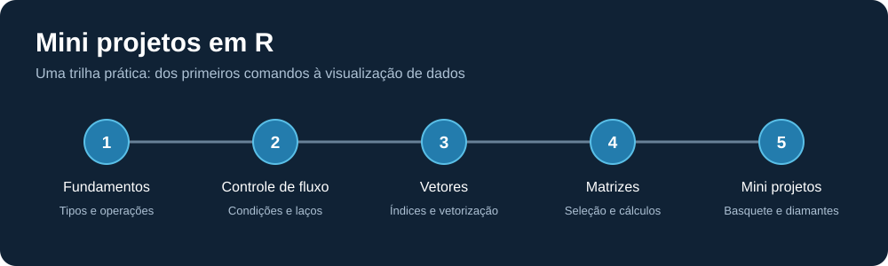
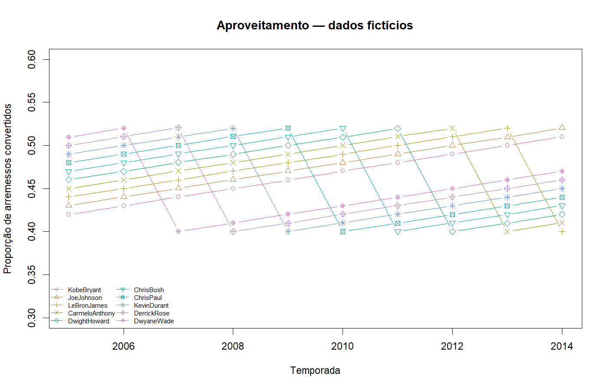
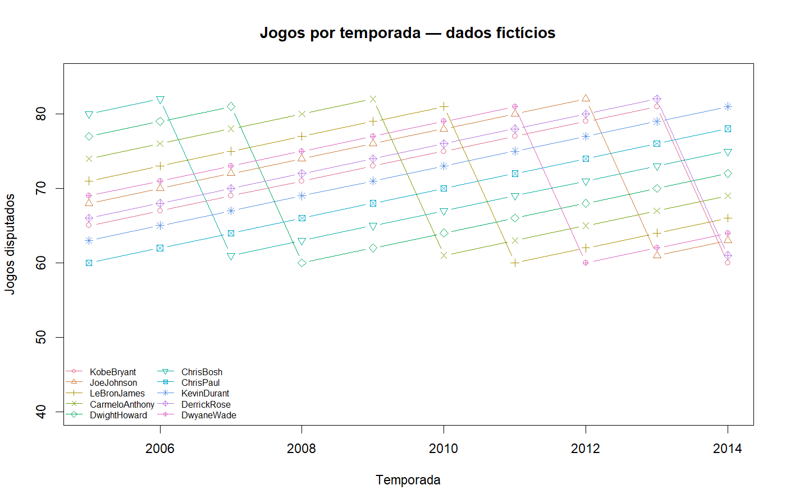
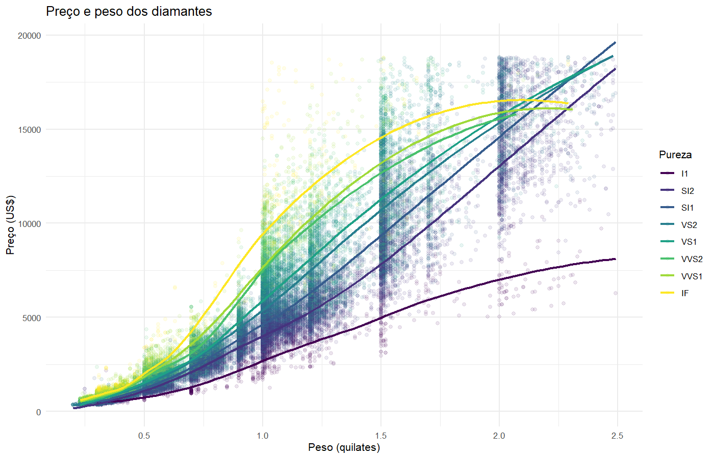

# Mini projetos em R

Repositório de estudos de R: dos primeiros comandos à análise de dados com matrizes, funções e gráficos. Os exercícios estão organizados em uma trilha progressiva, com dois mini projetos para aplicar os conceitos.



## Como começar

Ambiente validado com **R 4.6.1 e ggplot2 4.0.3** no Windows. O RStudio é opcional; abra `exercicios_R.Rproj` para trabalhar com a pasta do projeto como diretório atual. Todos os comandos abaixo devem ser executados na raiz do repositório.

No terminal:

```sh
Rscript scripts/instalar_dependencias.R
Rscript scripts/executar_todos.R
```

Se `Rscript` não estiver no PATH do Windows, use o caminho completo no PowerShell, ajustando a versão instalada:

```powershell
& "C:/Program Files/R/R-4.6.1/bin/Rscript.exe" scripts/instalar_dependencias.R
& "C:/Program Files/R/R-4.6.1/bin/Rscript.exe" scripts/executar_todos.R
```

A instalação usa internet e instala `ggplot2`, a única dependência externa direta. Os exercícios básicos e o projeto de basquete usam apenas R base. Sem `ggplot2`, o executor informa que o projeto de diamantes foi pulado e continua com os demais exemplos.

No console do RStudio:

```r
source("scripts/instalar_dependencias.R", encoding = "UTF-8")
source("scripts/executar_todos.R", encoding = "UTF-8")
```

Para estudar um arquivo individualmente, abra-o no RStudio e execute as linhas selecionadas, ou use:

```r
source("exercicios/03_vetores/02_indexacao.R", echo = TRUE, encoding = "UTF-8")
source("projetos/01_basquete/01_visualizacao.R", echo = TRUE, encoding = "UTF-8")
```

`echo = TRUE` exibe as expressões e seus resultados, inclusive nos exercícios que não usam `print()`. O executor cria um ambiente separado para cada arquivo, evitando que variáveis de um exercício interfiram nos seguintes.

## Trilha de aprendizado

| Etapa | Pasta | Conteúdo |
| --- | --- | --- |
| 1 | [Fundamentos](exercicios/01_fundamentos/) | Hello World, tipos de variáveis, operações e textos |
| 2 | [Controle de fluxo](exercicios/02_controle_de_fluxo/) | Condicionais, `while` e `for` |
| 3 | [Vetores](exercicios/03_vetores/) | Criação, coerção de tipos, índices e vetorização |
| 4 | [Matrizes](exercicios/04_matrizes/) | Dimensões, nomes, cálculos e seleção com `drop = FALSE` |
| 5 | [Basquete](projetos/01_basquete/) | Indicadores por temporada, `matplot()` e funções |
| 6 | [Diamantes](projetos/02_diamantes/) | Dispersão, transparência, cores e curvas com `ggplot2` |

## Mini projetos

### Basquete: matrizes e funções

Compara jogos e aproveitamento de arremessos de dez jogadores em dez temporadas. A base em [R/dados_basquete.R](R/dados_basquete.R) é **fictícia e determinística**, criada para substituir os objetos ausentes nos exercícios originais. Os nomes dos jogadores servem apenas como rótulos; os valores não representam estatísticas reais da NBA.

Os scripts calculam arremessos convertidos por jogo, desenham o aproveitamento por temporada e demonstram uma função que seleciona linhas sem perder a estrutura de matriz.

### Diamantes: visualização de dados

Usa `ggplot2::diamonds`, distribuído com o pacote, sem precisar selecionar um CSV externo. O gráfico relaciona peso em quilates e preço em dólares, separa a pureza por cor e filtra diamantes com menos de 2,5 quilates. A curva LOESS é uma exploração visual, não um modelo de previsão de preços.

## Estrutura

```text
exercicios_R/
├── exercicios/
│   ├── 01_fundamentos/
│   ├── 02_controle_de_fluxo/
│   ├── 03_vetores/
│   └── 04_matrizes/
├── projetos/
│   ├── 01_basquete/
│   └── 02_diamantes/
├── R/                         # Dados e função de exportação compartilhados
├── scripts/                   # Instalação e execução da trilha
├── docs/images/               # Imagens da documentação
├── outputs/                   # Gráficos gerados localmente
├── .editorconfig
├── .gitignore
├── exercicios_R.Rproj
└── README.md
```

## Imagens e resultados

Os mini projetos salvam automaticamente três imagens PNG em `outputs/`:

| Arquivo | Resultado |
| --- | --- |
| `basquete_aproveitamento.png` | Proporção de arremessos convertidos por temporada |
| `basquete_jogos.png` | Jogos disputados por temporada |
| `diamantes.png` | Preço por peso, com cores por pureza |

Esses arquivos são ignorados pelo Git. As cópias em `docs/images/` estão incluídas no repositório e são exibidas abaixo. São gráficos exportados pelos próprios scripts em R.

### Aproveitamento de arremessos



### Jogos por temporada



### Preço e peso dos diamantes




